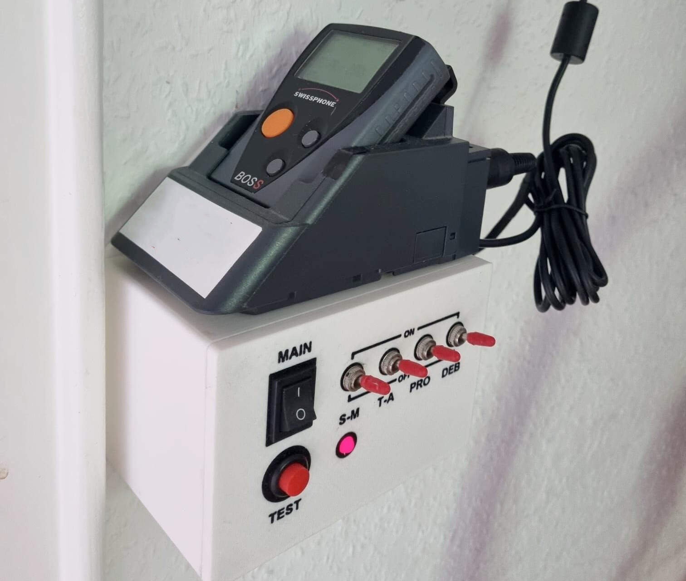
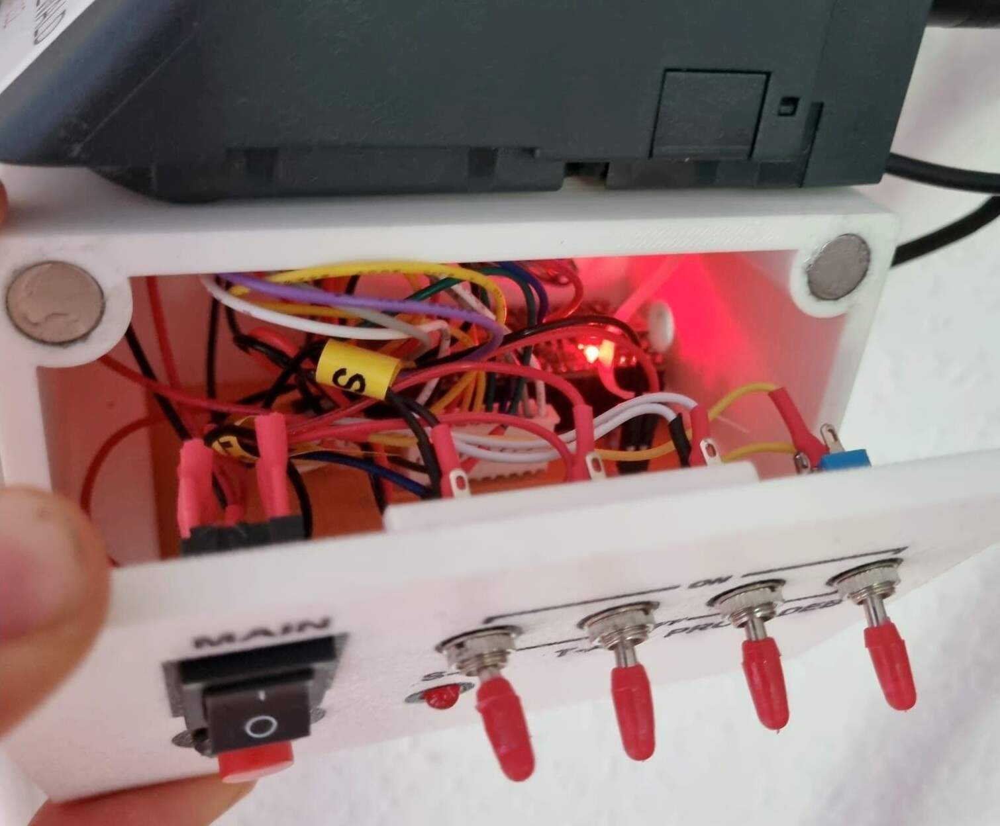

# Pager to SMS
Pagers (such as the Swissphone BOSS 910 used in this project) typically have a relay which is closed for 10 seconds when an alarm is received. The relay can be read out via a DIN 5-pin connector when the pager is in the charging cradle. With the help of an Arduino microcontroller (ESP32), the alarm is recognised and an SMS is then sent via Twilio. 




## Working with arduino-cli
## Installation of libraries
```
arduino-cli lib install --git-url https...
```

### Show connected boards
```
arduino-cli board list
```
In my case, the ESP is at port ```/dev/cu.usbserial-110```

### Compile
```
arduino-cli compile --fqbn esp32:esp32:esp32wrover SKETCHNAME
```

### Compile and upload
Go to parent directory of sketches (arduino folder), then 
```
arduino-cli compile --fqbn esp32:esp32:esp32wrover:UploadSpeed=115200 SKETCHNAME --upload -p PORTNAME
```
Make sure, that the serial monitor is not running at the same time.
### Serial monitor
```
arduino-cli monitor --port PORTNAME --config baudrate=115200
```

## Important

If you experience connection issues with the Twilio library, you meed need to update the certificates in the digicert.cpp file, see also https://github.com/ademuri/twilio-esp32-client/blob/master/src/digicert.cpp 

As of 02/2025 it is also necessary to add ```#include <string>``` to twilio.cpp in the Twilio library